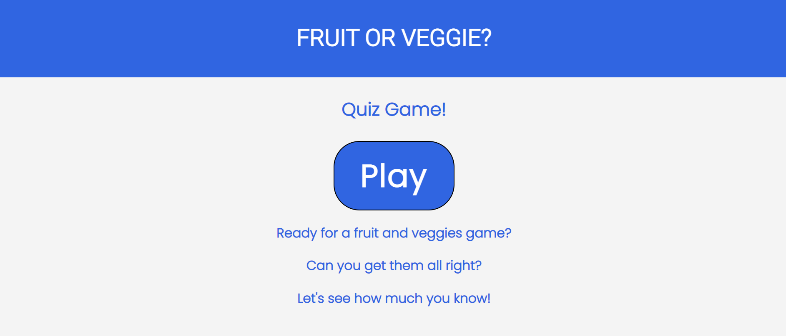
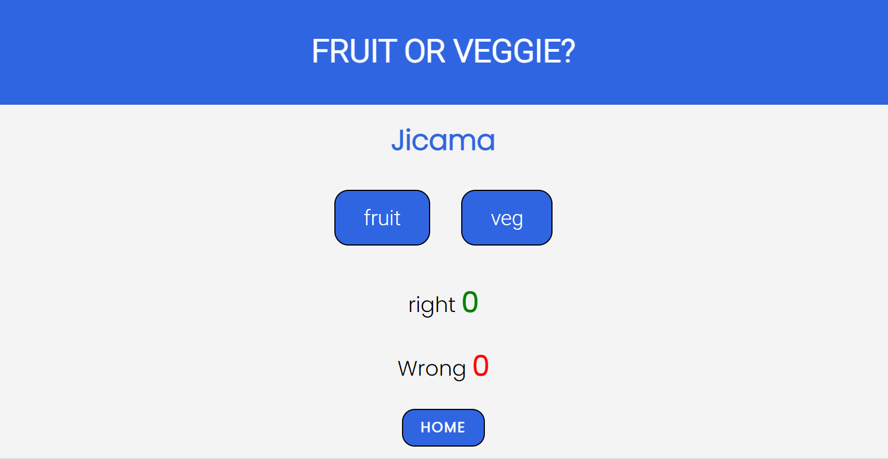
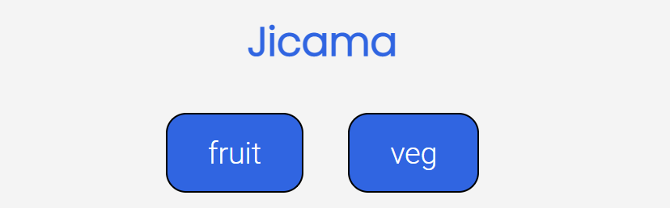
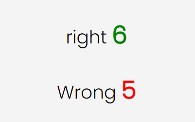
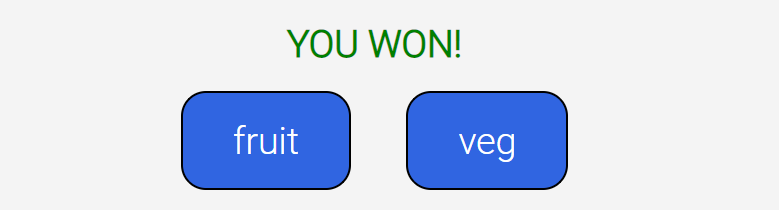

# Fruit or Vegetable Game
Welcome to the Fruit or Vegetable Game website! This interactive game is designed for someone to have fun and test their knowledge on fruits and vegetables.

 - Visit the website at https://rasmus1111.github.io/fruit-veggei-game/
 - For edecational purposes only.
 

## Features 
 Below is a list of the different features on the website
   
### Existing Features

  
- __The FRUIT OF VEGGIE? heading__

  - The heading is simple for easy viewing

 

- __the home page__

 - Here the user finds a large play button, followed by some fun text inciting the users interest.
 - This is where the user initiates the function that brings them to the game.

 
 
 

- __The Game page__

  - This is where the user plays the game.
  
 

- __The Question section and buttons__

  - Here a fruit or vegetable name is displayed at random.
  - Below there are two buttons displaying "fruit" and "veg" with the function of
    selecting whether it is a fruit or veggie

 

- __The Score Area__

  - Here the score is tallied bassed on the users choices.
  - correct answers are displayed in green to make it easy for the user. 
  - incorrect answers are displayed in red to make it easy for the user. 

 

- __Pop-up results__

 - When the user has reached 10 correct or 10 incorrect answers a pop-up 
  result appears with "YOU WIN!" or "YOU LOST!" respectively.

   

 

- __HOME button__
 - The home button takes the user back to the home page.
 - This is a simple inside navigation making it easier for the user. 

 

### Features Left to Implement 

- Add more animation with "YOU WIN!"

## Testing 

 - The game was tested on multiple devices such as phone, tablet and desctop.
   The user experience was good on all.
 - All features function as intended.
 - All features are easy and straightforward to use.

### Validator Testing 

- HTML
    - No errors were returned when passing through the official [W3C validator](https://validator.w3.org/)
- CSS
    - No errors were found when passing through the official [(Jigsaw) validator] (https://jigsaw.w3.org/css-validator/)
  
- JavaScript
    - No errors were found when passing through the official [Jshint validator](https://jshint.com/)
    - There are 10 functions in this file.
    - Function with the largest signature take 1 arguments, while the median is 0.
    - Largest function has 6 statements in it, while the median is 3.
    - The most complex function has a cyclomatic complexity value of 3 while the median is 1.5.
    

### Unfixed Bugs

 - There are no unfixed bugs.

## Deployment

- The website was deployed to GitHub pages. The steps used are: 
  - In the GitHub repository, navigate to "Settings" 
  - In "code and automation" which you will find on the left, select "pages"
  - From the branch section drop-down menu, select "main"
  - Then press "save"

## Credits 

- How to structure a README document was taken from Code Institutes template to create this README.md
- Help was taken from Code Institute's Student Support to create this project. 
- Font style was taken from Google fonts https://fonts.google.com/  